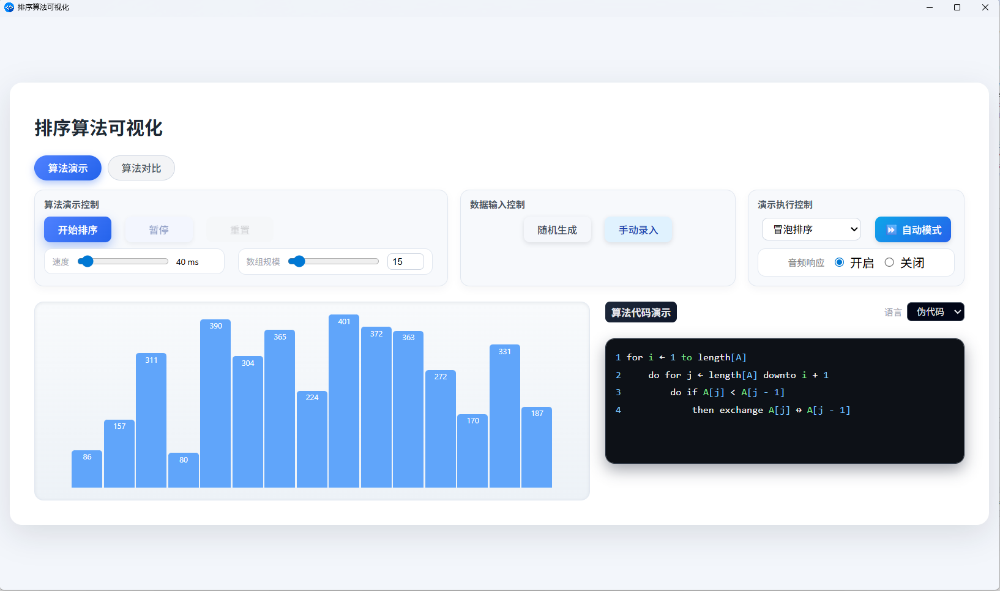
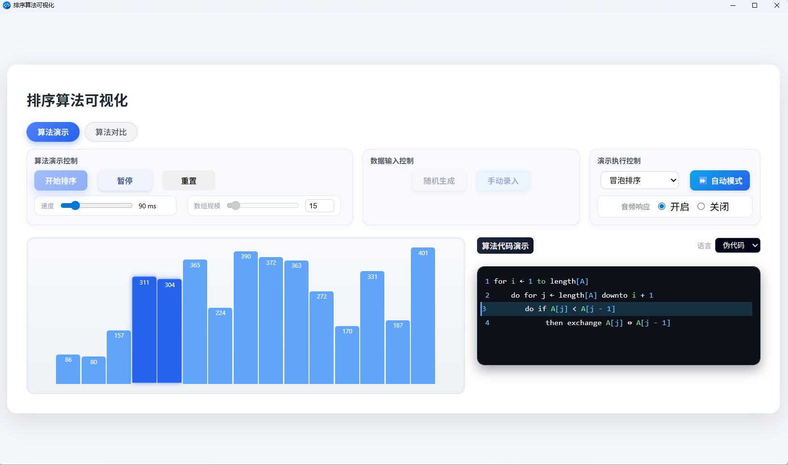
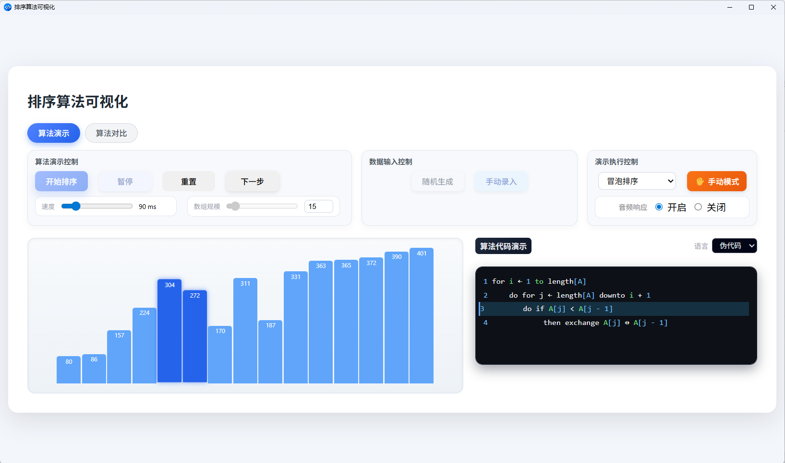

# Sort Algorithms Visualizer (排序算法可视化工具)


**Sort Algorithms Visualizer** 是一款基于 **Electron** 框架开发的桌面应用程序，旨在通过直观的动画效果展示经典排序算法的执行过程。

本项目不仅支持单算法的深度演示，还提供了**算法对比模式**，帮助开发者和学习者更形象地理解不同算法在时间复杂度、空间复杂度以及实际运行效率上的差异。

---
# 目录

- [技术栈](#️-技术栈)
- [核心特性](#-核心特性)
- [目录结构](#-目录结构)
- [环境配置与安装](#️-环境配置与安装)
- [使用指南](#-使用指南)
- [程序界面](#-程序界面)
- [Author](#-author)

---

## 🛠️ 技术栈
<<<<<<< HEAD

=======

>>>>>>> bc0f46ddb8d4e5f60c19f2902100343963f0971a

### 核心框架
- [Electron ](https://www.electronjs.org/)**(^39.2.6):** 使用 Web 技术构建跨平台的原生桌面应用程序

- [Node.js:](https://nodejs.org/) 提供底层文件系统访问与模块化管理支持

### 前端技术
- **HTML5 & CSS3:** 构建响应式的可视化布局与自定义 UI 组件

- **JavaScript (ES6+):** 实现复杂的排序算法逻辑、DOM 操作以及数据驱动的动画效果

### 第三方库与工具
- [Highlight.js:](https://highlightjs.org/)为演示区域的代码块提供多种编程语言的语法高亮支持

- **Electron-builder (^26.0.12):*** 负责将项目打包成 Windows (NSIS) 等平台的可执行安装包

---
## ✨ 核心特性

* **双模式切换**：支持“算法演示”与“算法对比”两种核心模式
* **多算法支持**：内置冒泡排序、选择排序、归并排序及快速排序
* **高度可控**：支持自定义数组规模（2-200）、动态调整执行速度（10ms-500ms），并提供开始、暂停、单步执行及重置功能
* **数据灵活输入**：支持随机生成数据或手动录入特定序列
* **多语言代码同步**：在演示算法时，同步显示伪代码及多种主流编程语言（C, C++, Python, Java）的实现代码，并支持语法高亮
* **性能简要分析**：对比模式下显示运行时间与时间复杂度分析

---

## 📂 目录结构

```text
├── assets/             # 预置图标与素材
├── codes/              # 各类语言的算法实现代码
├── js/
│   ├── algorithms/     # 排序算法核心逻辑
│   └── extra/          # 第三方库（如 Highlight.js）
├── styles/             # CSS 样式文件
├── image_src           # md用资源文件
├── index.html          # 主界面入口
├── main.js             # Electron 主进程文件
├── renderer.js         # 算法演示模式渲染逻辑
├── renderer-compare.js # 算法对比模式渲染逻辑
└── package.json        # 项目配置与依赖管理

```
---

## 🖥️ 环境配置与安装

在开始之前，确保系统中已安装 [Node.js](https://nodejs.org/)

### 1. 克隆仓库

```bash
git clone https://github.com/Neka-Ev/SortAlgorithms_Visualize.git
cd sortalgorithms_visualize

```

### 2. 安装依赖

项目使用了 `Electron` 及其构建工具 `electron-builder`：

```bash
npm install -g cnpm --registry=https://registry.npmmirror.com # 使用cnpm代替npm作为安装客户端以避免网络问题
cnpm install electron
cnpm install electron-builder

```

### 3. 运行开发版本

使用以下命令启动程序进行预览：

```bash
npm start

```

### 4. 项目打包

若需生成可执行文件，在管理员模式shell中：

```bash
npm run build

```

---

## 🚀 使用指南

1. **选择模式**：在界面顶部的选项卡中选择“算法演示”或“算法对比”
2. **配置参数**：
* 通过滑动条调整**速度**和**数组规模**
* 点击“随机生成”获取新数据，或点击“手动录入”输入你想要测试的数字序列


3. **开始观看**：点击“开始排序”，观察可视化区域的柱状图动态变化，同时参考右侧的代码面板学习具体实现
4. **音频调整**：点击音频控制区开启/关闭即可控制音频响应
4. **语言切换**：在代码面板的下拉菜单中切换你想查看的编程语言

---

## 📄 程序界面

### 算法演示界面
- #### 排序未开始

- #### 排序进行中

- #### 手动排序

- #### 手动录入数据

### 算法对比界面


---

## 👤 Author

 

> **University**: ***[Chang'an University](https://www.chd.edu.cn/)***

> **E-mail**: **wenyi4546@gmail.com**

> **Project**: **[SortAlgorithms_Visualize](https://github.com/Neka-Ev/SortAlgorithms_Visualize)**
